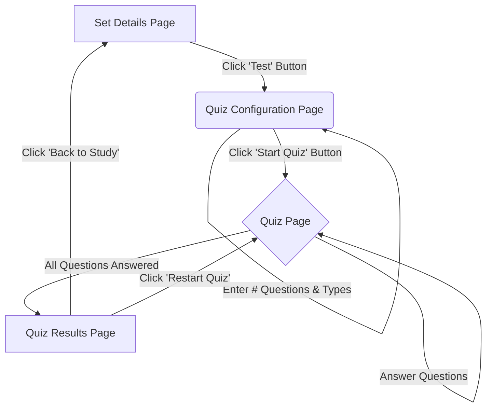

# Application Flow Diagrams

This document outlines key user flows within the TimeKill application using Mermaid diagrams.

## Quiz Flow

This diagram shows the user journey from selecting a set to completing a quiz.



## Study Modes Navigation

This diagram illustrates how users navigate from the dashboard to different study modes for a specific set.

```mermaid
graph TD
    Dashboard[User Dashboard] -- Click 'View Set' or 'Study' on a Set --> SetDetails[Set Details Page];
    SetDetails -- Click 'Flashcards' Button --> FlashcardsPage[/study/:id/flashcards];
    SetDetails -- Click 'Learn' Button --> LearnPage[/study/:id/learn];
    SetDetails -- Click 'Test' Button --> QuizConfigPage[/study/:id/quiz/configure];
    QuizConfigPage -- Configure & Start --> QuizPage[/study/:id/quiz];
```

## Main Dashboard Navigation

This diagram shows the primary navigation options available from the main user dashboard.

```mermaid
graph TD
    MainDashboard[Dashboard Page: /dashboard]
    MainDashboard -- Click 'Create Flashcards' Button --> CreatePage[/create];
    MainDashboard -- Click 'View All Sets' Button --> AllSetsPage[/sets]; 
    MainDashboard -- Click 'Humanize Text' Button --> HumanizePage[/humanize];
    MainDashboard -- Click 'Study' on a Recent Set --> StudyPage[/study/:id];
    MainDashboard -- Click Set Name on a Recent Set --> SetDetailsPage[/sets/:id];
    MainDashboard -- Click 'Upgrade to Pro' Button --> PricingPage[/pricing];
    MainDashboard -- Click Avatar/User Menu --> UserMenuOptions;
    UserMenuOptions -- Click 'Settings' --> SettingsPage[/settings];
    UserMenuOptions -- Click 'Sign Out' --> SignOutPage[/sign-out];
```

*Note: The '/sets' link from the main dashboard was inferred from the user's request to fix links on the main dashboard and the presence of a `/sets` directory. If this page doesn't exist or has a different primary purpose, this part of the diagram might need adjustment.*
